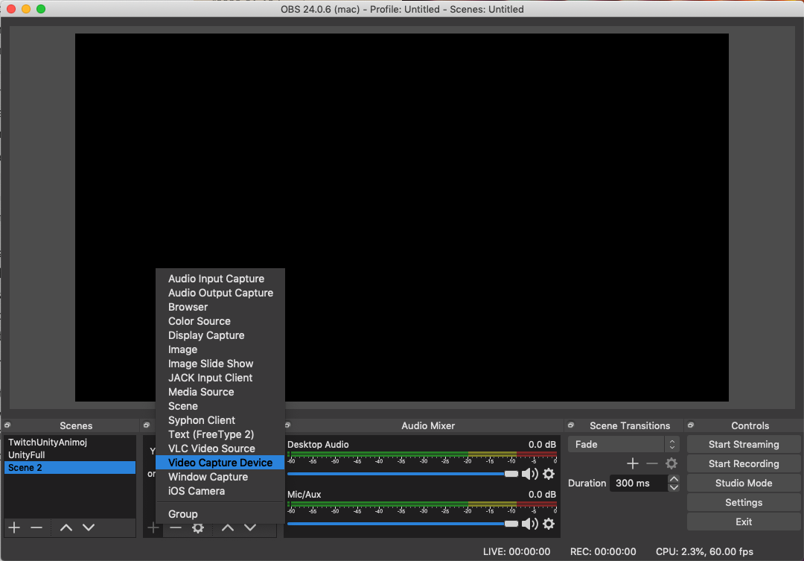
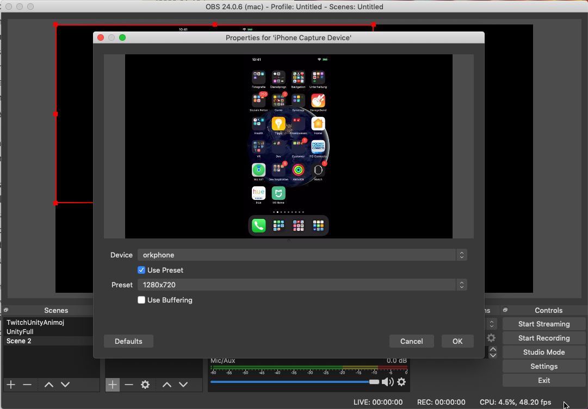

When I planned out my goals for 2020 video played a big role in it since I want to try to create regular youtube videos of how-to's that I post in the [blog](/blog/) as well as [devlogs](/blog/devlogs/) and the likes but I also wanted to try to host regular dev livestreams.
For that you obviously need a camera connected to your computer and the only one i had was the FacetTime cam on my MacBook and while its supposedly a good integrated webcam the camera angle sucks and the quality isn't all to great but I also own an iPhone XS  which should have a pretty good integrated cam so I went on a journey to find out how to use it as a webcam  or more precisely a streaming camera.

Its by far not as straight forward as i would have hoped and I'm no yet really satisfied with my solution but at least it works and the quality is better then a regular which I also tried out. 

This tutorial currently has only been tested with OBS on a mac I'll update the article once I got around to also test it on windows.

First you need to connect your iPhone with your mac via usb and on your phone there might be a popup asking if you trust this computer which you should do. 
Next you open OBS and add a new Video Capture Device to your scene.
In the dialog that pops up then you should be able to select your phone and select the preset with the highest resolution.

After a few seconds you should already see your iPhone screen in the preview window. After that you just need to press ok and can capture your device (which also may come in handy if you want to stream mobile gameplay).

Now since you can capture your phone screen you just need to open your camera app and can see the video feed. 
The problem now still is you see all the camera controls on the screen and while you could apply a crop filter to remove the borders by right clicking on the capture device and then going into filters. you would still see the focus rects which are not deactivatable.
So ideally you would need a camera app with no controls but i could not find one in the App Store so I actually might build one myself but until then there is also another option that does not even need us to install an app. [WebRTC](https://webrtc.org) to the rescue! [WebRTC](https://webrtc.org) allows you to interact with your phone camera from a website through safari and there are some free [samples](https://webrtc.github.io/samples/) on GitHub the allow us todo just that.
There are some that allow to apply some simple filters and one to [choose camera, microphone and speaker](https://webrtc.github.io/samples/src/content/devices/input-output/) which is ideal for our use case since we probably wan't to select the rear camera for the best image quality.

Now you just need to scroll the video frame in your phone screen to a position where it fills as much of the screen as possible and you're ready to go.
Depending on the iPhone you use you still might need to apply a bit of crop filtering on the sides though.

<!--stackedit_data:
eyJoaXN0b3J5IjpbMTg5NDg3MzE4MSwxMzI5OTEyNDUyLDEzNT
c2MzcxODEsNDYxOTI2NzAyLC0zMTYyODcxNDgsMTA2MDg1NjQ1
NSwtMTM2MDQ3NjIsMjQ2NzgxMTczLC00MTQ2OTUyNzEsMTAwMj
ExNDgzNywtMTMyNjQzNzA5NCwxNzQwNjA0MiwtMTUxODcyOTgz
LDY5NDQ5Mjg4MiwxMDY3ODQ1MzIzLC0yOTQyNTA5MDddfQ==
-->